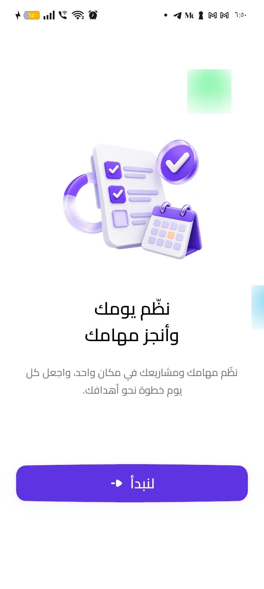
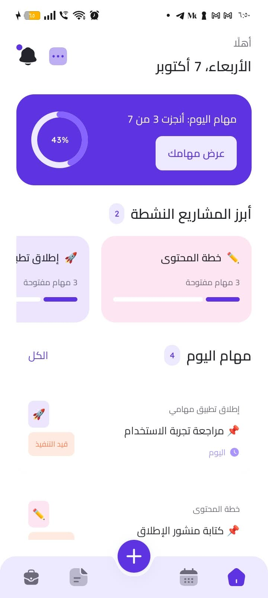
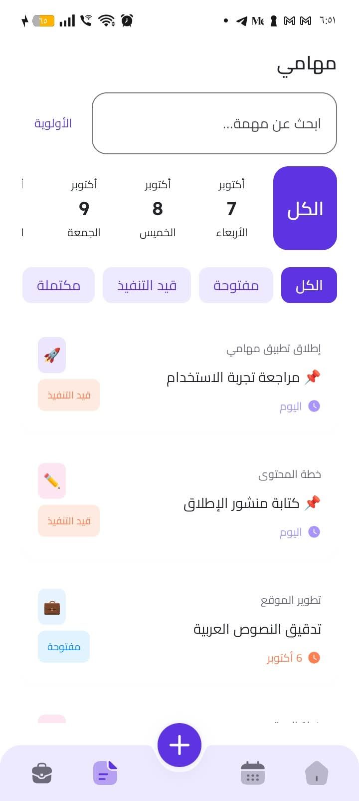
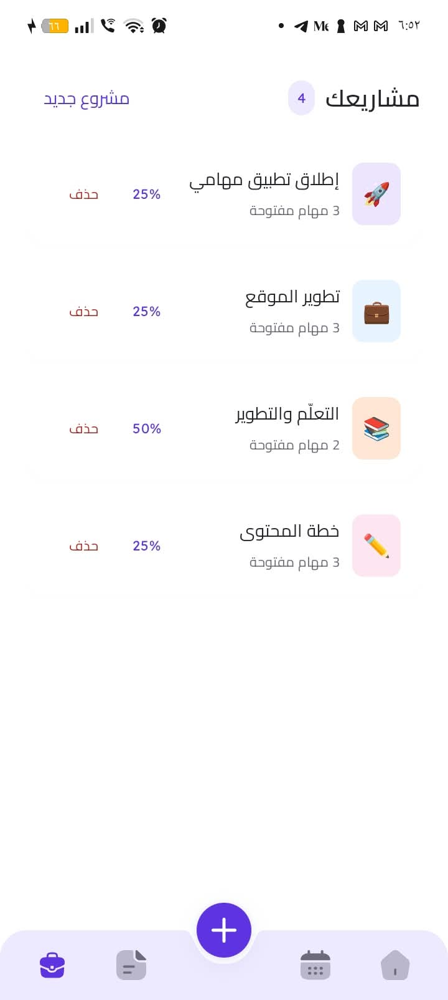
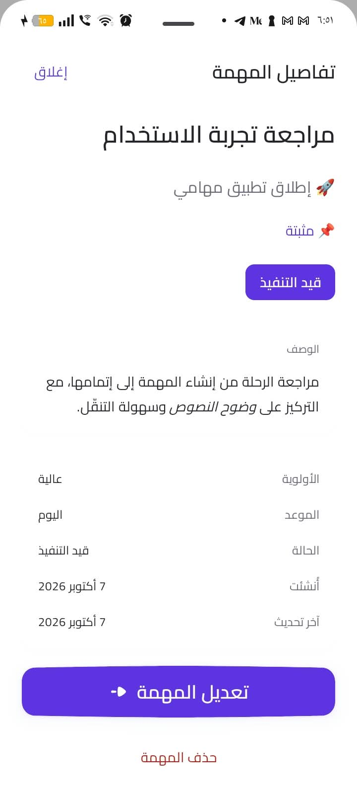
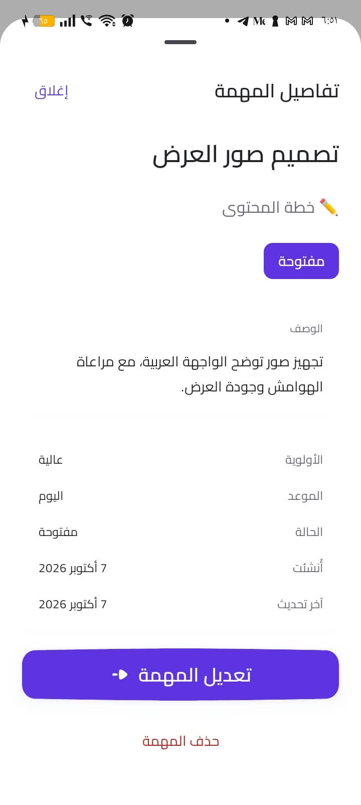
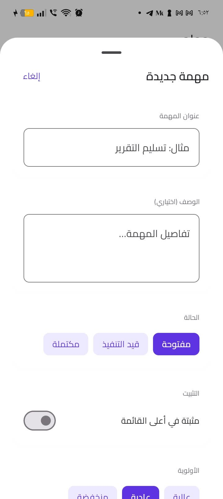
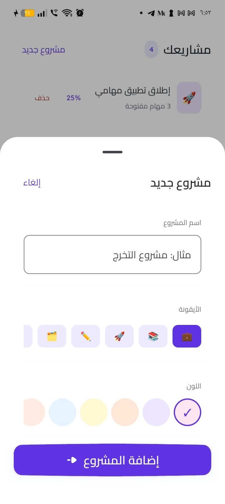

<div align="center">
  
  <h1>مهامي · Mahami</h1>
  <p><strong>Organize your day. Move your projects forward.</strong></p>
  <p dir="rtl">نظّم يومك وأنجز مهامك — مهامك ومشاريعك في مكان واحد.</p>
  <p><strong>Native iOS &amp; Android apps · Arabic-first · Local storage</strong></p>
  <p>
    
    
    
    
  </p>
  <p>
    <a href="#screenshots"><strong>See the app ↓</strong></a> &nbsp; · &nbsp;
    <a href="#native-on-both-platforms"><strong>Explore the stack</strong></a> &nbsp; · &nbsp;
    <a href="#run-locally"><strong>Run locally</strong></a> &nbsp; · &nbsp;
    <a href="#more-by-hussein-abozina"><strong>More projects ↗</strong></a>
  </p>
</div>

Mahami is an Arabic task and project manager built around a simple daily flow: capture a task, give it a priority and a date, organize it under a project, and follow your progress. Purple accents, clear Arabic typography and project colors connect the experience across both platforms.

**Two native implementations:** iOS is written in **Swift with SwiftUI**, and Android in **Kotlin with Jetpack Compose**. Each platform has its own UI, state management and local persistence, with shared product rules.

## Screenshots

Actual **Android app captures supplied by the project owner on October 8, 2026**, using fictional presentation data. These show the Android experience; iOS has a separate native implementation.

<table>
  <tr>
    <td align="center" width="50%">
      <a href="docs/showcase/screenshots/welcome.jpg"></a><br/>
      <strong>A clear beginning</strong><br/><sub>Arabic welcome and productivity illustration</sub>
    </td>
    <td align="center" width="50%">
      <a href="docs/showcase/screenshots/home.jpg"></a><br/>
      <strong>Your day at a glance</strong><br/><sub>Daily progress, active projects and tasks</sub>
    </td>
  </tr>
  <tr>
    <td align="center">
      <a href="docs/showcase/screenshots/tasks.jpg"></a><br/>
      <strong>Focus on the next task</strong><br/><sub>Search, dates, status filters and pinned priorities</sub>
    </td>
    <td align="center">
      <a href="docs/showcase/screenshots/projects.jpg"></a><br/>
      <strong>Give every project a place</strong><br/><sub>Project identities, task counts and progress</sub>
    </td>
  </tr>
</table>

<details>
<summary><strong>See task details and creation screens — 4 more captures</strong></summary>

<table>
  <tr>
    <td align="center" width="50%">
      <a href="docs/showcase/screenshots/task-detail.jpg"></a><br/>
      <strong>The context behind the task</strong><br/><sub>Formatted notes, priority, dates and status</sub>
    </td>
    <td align="center" width="50%">
      <a href="docs/showcase/screenshots/task-description.jpg"></a><br/>
      <strong>Keep the details close</strong><br/><sub>Project context and editable task information</sub>
    </td>
  </tr>
  <tr>
    <td align="center">
      <a href="docs/showcase/screenshots/new-task.jpg"></a><br/>
      <strong>Capture a new task</strong><br/><sub>Title, notes, status, pinning and priority</sub>
    </td>
    <td align="center">
      <a href="docs/showcase/screenshots/new-project.jpg"></a><br/>
      <strong>Make a project recognizable</strong><br/><sub>A name, an icon and a color</sub>
    </td>
  </tr>
</table>

</details>

[Open the original screenshots and capture notes](docs/showcase/README.md).

## Features

| Flow | Experience |
| --- | --- |
| Plan the day | Daily progress, today's tasks and an overdue indicator |
| Capture a task | Quick add or a full editor with a title, notes, priority, date and optional project |
| Follow through | Open, in progress and completed states; complete or reopen a task |
| Find the right work | Title search and filters for date, status, priority and project |
| Keep priorities visible | Pinned tasks and three priority levels |
| Organize projects | Project names, emoji, colors, open task counts and completion progress |
| Look ahead | A monthly calendar with task counts and day-to-task navigation |
| Keep useful context | Task details with lightweight Markdown formatting |
| Keep your work | Persistent local storage; deleting a project keeps its tasks |
| Remember the time | Optional local task reminders, updated or cancelled with the task |
| Carry work between devices | Optional email account and manual personal cloud sync with a backup before first sync |
| Read comfortably | Arabic RTL layouts, Cairo/Lexend typography and system light/dark themes |

## Native on both platforms

| | iOS | Android |
| --- | --- | --- |
| Language | Swift | Kotlin |
| Interface | SwiftUI | Jetpack Compose / Material 3 |
| Local persistence | SwiftData | Room |
| State | Observation / screen models | ViewModel / StateFlow |
| Concurrency | Swift concurrency | Kotlin coroutines / Flow |
| Minimum OS | iOS 17 | Android 8.0 · API 26 |
| Source | [ios/TaskManagement](ios/TaskManagement) | [android/app/src/main](android/app/src/main) |

Both applications separate presentation, domain contracts and data implementations. Task dates, completion, project deletion and sorting follow the same documented [data rules](docs/architecture/DATA_CONTRACTS.md).

## Project status

**An actively developed portfolio project.** The current Android presentation build has been built, installed and opened on a physical Android 15 device. Its demo import added four projects and sixteen tasks; a second import added zero duplicates.

| Area | Current state |
| --- | --- |
| Core local experience | Implemented in both native codebases; the supplied captures are from Android |
| Android verification | Debug build/lint, installation, launch and demo import verified; reminder and cloud verification details are tracked in the project state |
| iOS verification | Simulator build and startup to the existing Home verified; physical-device and cloud acceptance remain pending |
| Reminders | Native implementations on both platforms; Android delivery and task-opening checks are recorded in the verification notes |
| Cloud sync | Both clients use the deployed owner-only, atomic sync RPC; stale writes, deletion, date-only transport and isolation verified in rollback fixtures; real-account two-device acceptance pending |
| Store release | No App Store or Google Play release is linked in this showcase |

The screenshots use fictional presentation content. Demo import is explicit in the Android debug build; normal launches preserve existing data without inserting samples. See [current project state](docs/project/CURRENT_STATE.md) for the detailed verification record.

<details>
<summary><strong>For developers: local setup and repository map</strong></summary>

## Run locally

```sh
git clone https://github.com/Husseinabozina/task_management_native.git
cd task_management_native
```

### iOS

On a Mac with Xcode supporting the iOS 17 deployment target:

1. Open [ios/TaskManagement.xcodeproj](ios/TaskManagement.xcodeproj).
2. Select the **TaskManagement** scheme and an iPhone or simulator.
3. Let Xcode resolve the package dependencies, then run.

The generated Xcode project is included. [ios/project.yml](ios/project.yml) is the XcodeGen source if you need to regenerate it. Local tasks use SwiftData; optional cloud configuration is separate from the local presentation flow.

### Android

Open the [android](android) folder in Android Studio, configure **Android SDK 36** and a compatible Gradle JDK, then select a device and run. The checked-in wrapper is Gradle 8.14.3; the recorded local build used JDK 24.0.2. The source targets Java/JVM 17.

To build and lint from the repository root, with your SDK configured:

```sh
./android/gradlew -p android :app:assembleDebug :app:lintDebug \
  -Pkotlin.compiler.execution.strategy=in-process
```

APK output: `android/app/build/outputs/apk/debug/app-debug.apk`.

On macOS, [android/run-on-device.command](android/run-on-device.command) builds, installs with existing data retained, and opens the app on one connected, USB-debugging-authorized phone. Set the SDK and cache paths for your machine:

```sh
export ANDROID_HOME="/path/to/Android/sdk"
export GRADLE_USER_HOME="$HOME/.gradle"
./android/run-on-device.command

# Explicitly add the fictional presentation content to a debug build.
./android/run-on-device.command --seed-demo
```

The script also accepts `--serial DEVICE_ID` when multiple phones are connected. It reads `sdk.dir` and the optional `taskmanagement.gradleUserHome` from ignored `android/local.properties`; environment variables take precedence. Demo identifiers are stable: repeat imports preserve existing rows and respect deleted samples. Once installed, open **مهامي** from the phone's launcher without a computer or cable.

### Optional personal cloud sync

Local tasks work without an account. To enable email/password accounts and manual sync in your build, follow the [cloud setup guide](docs/supabase/SETUP.md). Real client configuration stays outside Git; each platform includes a configuration example. The first sync saves a local backup and binds the local data set to that account.

See [Security and local configuration](SECURITY.md) before adding keys, signing files or app data to a checkout.

### Repository map

```text
ios/                 SwiftUI app, domain, SwiftData and platform services
android/             Compose app, domain, Room and device launcher
assets/figma/        Original design references, icons and shapes
docs/showcase/       README media and capture provenance
docs/product/        Scope and user flows
docs/architecture/   Architecture, data contracts and decisions
docs/project/        Verified state, acceptance checklist and backlog
```

[Architecture](docs/architecture/ARCHITECTURE.md) · [Data contracts](docs/architecture/DATA_CONTRACTS.md) · [Acceptance checklist](docs/project/ACCEPTANCE_CHECKLIST.md)

</details>

## More by Hussein Abozina

| Project | Explore |
| --- | --- |
| **NOVA** — fashion shopping experience | [View the portfolio ↗](https://husseinabozina.github.io/fashion_e_commerce/) |
| **Brees** — fintech mobile experience | [View the portfolio ↗](https://husseinabozina.github.io/Brees-Mobile-App/) |
| **HealthTrack** — healthcare UI portfolio | [View the portfolio ↗](https://husseinabozina.github.io/medical_app/) |

**Hussein Abozina** · [GitHub profile](https://github.com/Husseinabozina) · [Project repository](https://github.com/Husseinabozina/task_management_native)

<sub>Design foundation: <a href="https://www.figma.com/design/oja3AAf5WtxELKlXH0v4dn/Task-management---to-do-list-app--Community-?node-id=101-100">Task management &amp; to-do list app — Figma Community</a>. Arabic copy and the current productivity illustration were adapted for Mahami. <a href="docs/showcase/README.md">Media provenance</a>.</sub>
